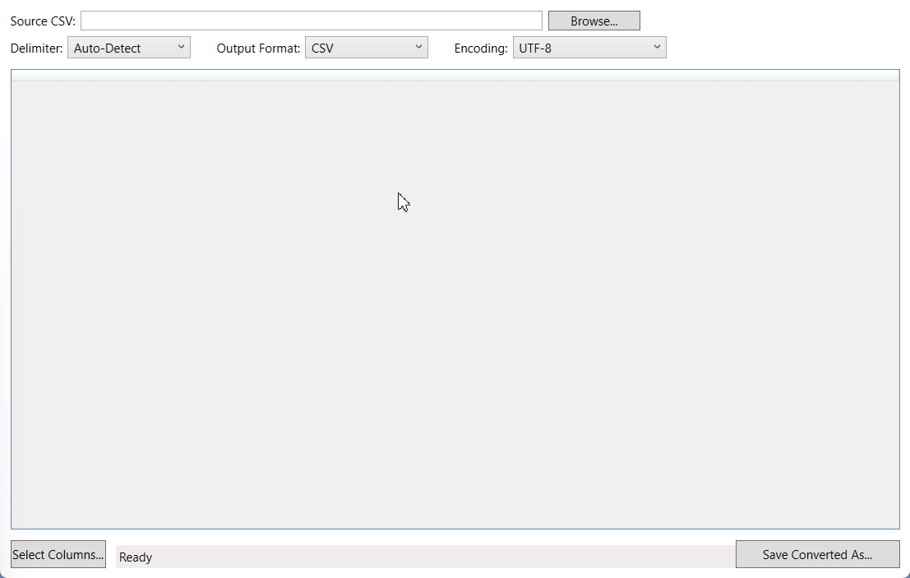

# **📄 CSV Converter Tool**

A lightweight Windows desktop utility for quickly inspecting and converting CSV-style files.

Load a CSV/TSV/text file, preview it in a sortable table, choose which columns to keep, and export to CSV, TSV, or JSON with your preferred encoding.

---

## **✨ Features**

### **🔍 Auto delimiter detection**

* Automatically detects common delimiters such as:

  * `,` (comma)
  * `;` (semicolon)
  * `\t` (tab)
  * `|` (pipe)
* Optionally choose a delimiter manually.

### **👀 Table preview**

* Displays parsed CSV in a sortable WPF DataGrid.
* Click any column header to sort.
* Status bar shows row & column counts.

### **🧩 Column selection**

* “Select Columns” dialog lets you toggle which columns to include.
* Preview updates live to show only selected columns.
* Ensures you never export unwanted data.

### **💾 Flexible export options**

* Export to:

  * **CSV**
  * **TSV**
  * **JSON** array of objects
* Choose output encoding:

  * **UTF-8 (default)**
  * **Shift-JIS**
  * **Windows-1252**
* Uses UTF-8 without BOM unless otherwise selected.

### **🛠️ User-friendly error handling**

* Clear messages for malformed files and failed delimiter detection.
* Handles IO exceptions gracefully (read/write/locked files).
* Status bar updates for loading, filtering, and saving operations.

---

## **Demo GIF**



---

## **📦 Requirements**

* **OS:** Windows 10 or later
* **Runtime:** .NET 6 or .NET 8 Desktop Runtime
* **Framework:** WPF

---

## **🚀 Getting Started**

### **Clone & Build**

```bash
git clone https://github.com/YOUR_USERNAME/csv-converter-tool.git
cd csv-converter-tool
```

Open the solution in **Visual Studio**, build in **Release** mode.

### **Run the App**

Launch the compiled `.exe` from:

```
/bin/Release/net6.0-windows/
```

---

## **🧭 Usage Guide**

### **1. Open a file**

1. Click **Browse…**
2. Select a `.csv`, `.tsv`, or `.txt` file.
3. Tool auto-detects delimiter (or prompts you to choose manually if unclear).
4. Data loads into the preview grid.

### **2. Inspect and sort**

* Click headers to sort ascending/descending.
* Status bar shows:

  * Row count
  * Column count

### **3. Select columns**

1. Click **Select Columns…**
2. Check/uncheck columns to keep.
3. Preview updates automatically.

### **4. Choose output format**

* Use the **Output Format** dropdown:

  * CSV
  * TSV
  * JSON

### **5. Select encoding**

* Choose from:

  * UTF-8
  * Shift-JIS
  * Windows-1252

*Requires: `Encoding.RegisterProvider(CodePagesEncodingProvider.Instance);` — already enabled.*

### **6. Save your output**

* Click **Save As…**
* Select file name & location.
* Tool writes only the selected columns in the chosen format & encoding.

---

## **🧹 Error Handling**

The tool provides meaningful feedback for:

### **Invalid format**

* Improperly structured CSV
* Wrong delimiters
* Mixed row lengths

### **File access issues**

* File locked by another program
* Insufficient permissions
* Invalid output path

### **Encoding issues**

* Uses registered codepages for Shift-JIS/Windows-1252
* Falls back safely to UTF-8

---

## **📂 Project Structure**

```
/CsvConverterTool
│
├── MainWindow.xaml / MainWindow.xaml.cs     # UI & event handlers
├── CsvParser.cs                             # Delimiter detection & parsing
├── DelimitedWriter.cs                       # CSV/TSV output
├── JsonWriter.cs                             # JSON output
├── DataTableUtils.cs                        # Column filtering & utilities
├── ColumnSelectionWindow.xaml               # Column selector dialog
└── README.md
```

---

## **🔮 Future Improvements (Optional)**

* Input encoding dropdown (UTF-8 vs Shift-JIS vs auto-detect)
* Preview row limit for very large files
* Excel export (.xlsx)
* Enhanced auto-detection for more exotic delimiters

---

## **📄 License**

> *TODO: Add your preferred license (MIT recommended).*


